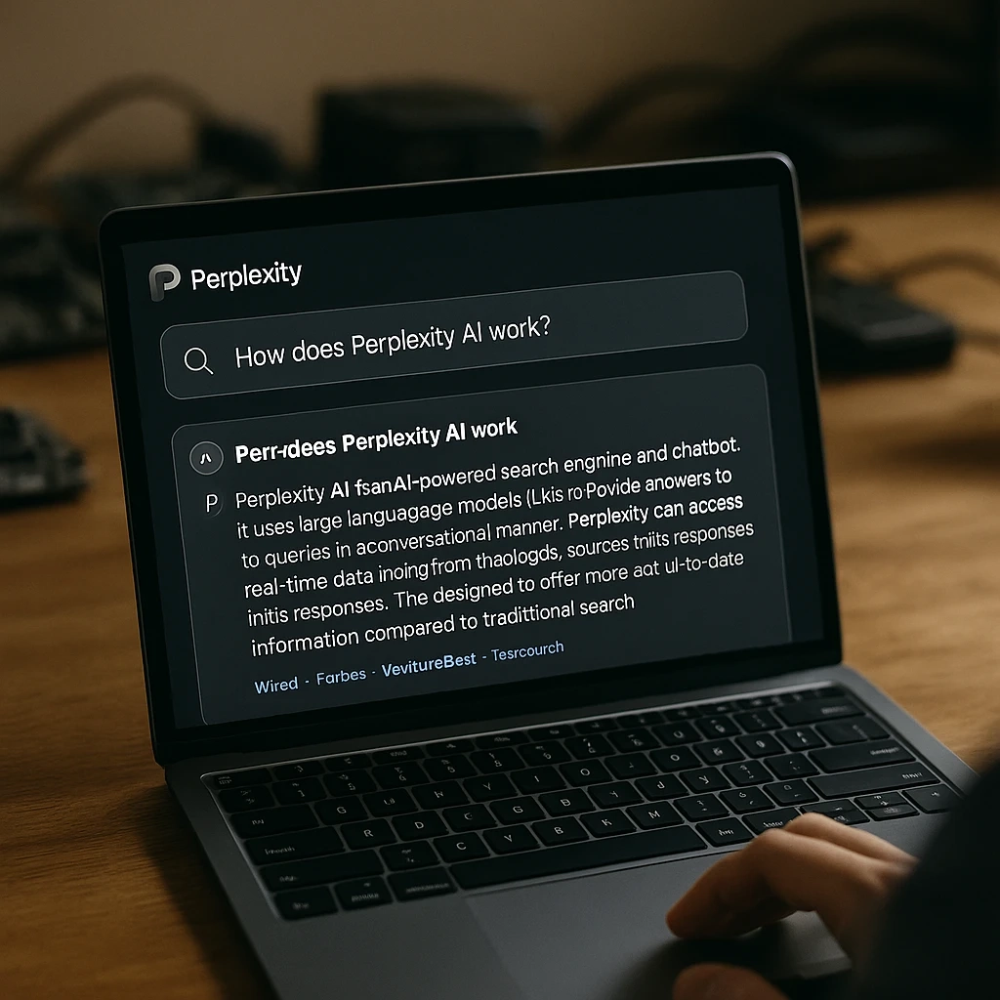
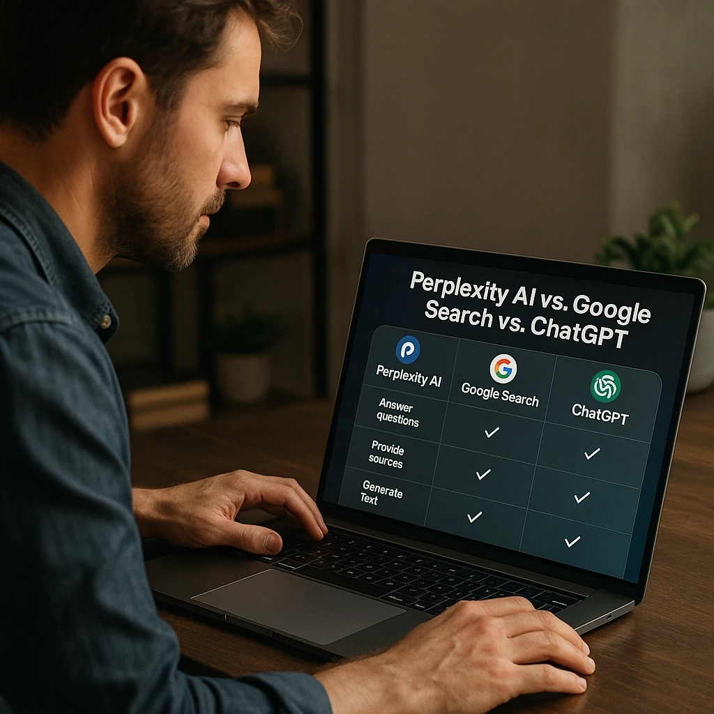

# What is Perplexity AI: Your Complete Guide to AI Search in 2025

---

Perplexity AI has become a game-changing search tool that's reshaping how we find information online. With over 15 million active users and 780 million queries in May 2025 alone, this AI-powered search engine combines artificial intelligence with real-time web search to deliver accurate, cited answers to complex questions. Whether you're researching for work, studying for school, or just curious about the world, understanding what Perplexity AI can do might change how you search forever.

---

So, what exactly is Perplexity AI? Think of it as that friend who not only knows where to find answers but actually reads through everything and gives you the summary with receipts attached.

## What is Perplexity AI?

Perplexity AI is an advanced AI-powered search engine that answers your questions by searching the web and synthesizing information from multiple sources in real-time. Unlike traditional search engines that hand you a list of links and say "good luck," Perplexity AI gives you direct, comprehensive answers with proper citations.

Founded in 2022, this platform has quickly grown into a major competitor to Google Search and ChatGPT, reaching a valuation of $9 billion by 2025. The secret sauce? It combines large language models with real-time web data to provide up-to-date, accurate information on almost any topic.

## How Does Perplexity AI Actually Work?

Here's where it gets interesting. Perplexity AI operates through a sophisticated multi-step process that sets it apart from both traditional search engines and chatbots:

**The Search Process:**

1. **Query Analysis**: The AI breaks down your question to understand intent and context
2. **Web Crawling**: It searches the internet in real-time across multiple sources
3. **Information Synthesis**: The AI processes and combines information from various sources
4. **Answer Generation**: It creates a comprehensive response with proper citations
5. **Source Verification**: All answers include links to original sources for fact-checking

**The Technology Behind It:**

Perplexity AI leverages several advanced AI models, including:

- GPT-4 and GPT-4 Turbo
- Claude 3 (Opus, Sonnet, Haiku)
- Gemini 2.5 Pro
- Meta's Llama models
- Perplexity's own Sonar models

This multi-model approach means you're not stuck with one AI's perspective or limitations. It's like having a panel of experts instead of just one.

## What Can Perplexity AI Do?

Let's talk features. Perplexity AI offers a range of capabilities that make it valuable for research, learning, and information discovery:

**Core Features:**

- **Real-Time Research**: Get current information on any topic with live web search capabilities
- **Conversational Search**: Ask follow-up questions and have natural conversations
- **Source Citations**: Every answer includes proper citations and links to original sources
- **Multi-Language Support**: Search and get answers in multiple languages
- **Visual Content**: Generate and analyze images alongside text responses

**Advanced Features (Pro Version):**

- **Unlimited Searches**: No daily limits on Pro searches
- **File Upload**: Analyze PDFs, images, and documents
- **Advanced AI Models**: Access to the latest GPT-4, Claude, and other premium models
- **Perplexity Labs**: Transform prompts into spreadsheets, dashboards, and apps
- **API Access**: Integrate Perplexity's capabilities into your own applications

## Breaking Down Perplexity AI Features

**Core Search Capabilities:**

- **Quick Search**: Fast answers using Perplexity's optimized models
- **Pro Search**: Deep research using advanced AI models with enhanced reasoning
- **Focus Modes**: Target specific types of content (Academic, Reddit, YouTube, etc.)
- **Collections**: Save and organize your research into themed groups
- **Memory**: The AI remembers context from previous conversations

**Recent 2025 Updates:**

According to the latest developments, Perplexity AI has introduced several exciting features:

- **Voice Assistant**: iOS app with action capabilities
- **Shopping Assistant**: AI-powered product search with one-click checkout
- **Comet Browser**: Beta AI-powered web browser (coming soon)
- **WhatsApp Integration**: Access Perplexity directly through WhatsApp
- **Enhanced Labs**: Transform research into interactive applications

👉 [Discover how Perplexity AI's real-time search capabilities can revolutionize your research workflow](https://pplx.ai/ixkwood69619635)

## Is Perplexity AI Free?

Yes, Perplexity AI offers a robust free tier while also providing premium subscriptions:

**Free Plan Features:**

- Unlimited Quick Searches
- 5 Pro Searches per day
- Basic AI model access
- Standard search features
- Mobile and web access

**Perplexity Pro ($20/month):**

- Unlimited Quick Searches
- 300+ Pro Searches per day
- Access to GPT-4, Claude 3, and other advanced models
- File upload and analysis
- Access to Perplexity Labs
- Priority customer support

**Perplexity Max ($200/month):**

- All Pro features
- Unlimited access to Perplexity Labs
- Advanced AI model priority
- Enhanced API access

**Enterprise Pro ($400/year):**

- Team collaboration features
- Enhanced security and privacy
- Dedicated support
- Custom integrations

## Perplexity AI vs. Other Search Engines

**vs. Google Search**

*Perplexity Advantages:*
- Direct answers instead of link lists
- Conversational interface
- Real-time synthesis of multiple sources
- No ads cluttering results

*Google Advantages:*
- Broader web indexing
- Local search and maps
- Established ecosystem
- Image and video search specialization

**vs. ChatGPT**

*Perplexity Advantages:*
- Real-time web access
- Source citations
- Current information (not limited to training data)
- Specialized for research and factual queries

*ChatGPT Advantages:*
- Better for creative writing
- Stronger conversational memory
- More advanced reasoning for complex tasks
- Better coding assistance

**vs. Traditional AI Assistants**

Perplexity AI excels in scenarios involving:
- Current events and breaking news
- Research with source verification
- Multi-source information synthesis
- Academic and professional research

## Who Created Perplexity AI?

Perplexity AI was founded in 2022 by a group of AI researchers and engineers:

- **Aravind Srinivas** (CEO): Former OpenAI researcher with expertise in machine learning
- **Denis Yarats** (CTO): Former Meta AI researcher specializing in reinforcement learning
- **Johnny Ho**: Former Quora engineer with search expertise
- **Andy Konwinski**: Co-founder of Databricks with distributed systems background

The company has raised significant funding, including a recent $500 million round at a $14 billion valuation, with investors including NVIDIA, SoftBank, and other major tech companies.

## Best Use Cases for Perplexity AI

**Academic Research:**
- Literature reviews with proper citations
- Current scientific developments
- Cross-referencing multiple academic sources
- Fact-checking and verification

**Business Intelligence:**
- Market research and competitor analysis
- Industry trend monitoring
- Product research and comparison
- Strategic planning insights

**Content Creation:**
- Research for articles and blog posts
- Fact-checking and source verification
- Topic exploration and ideation
- Multi-perspective analysis

**Personal Learning:**
- Explaining complex concepts
- Current events and news analysis
- How-to guides with step-by-step instructions
- Learning new skills and topics

## Getting Started with Perplexity AI

**Step 1: Access the Platform**

Visit perplexity.ai or download the mobile app (iOS/Android). You can start using the free tier immediately.

**Step 2: Try Your First Query**

Start with a specific question rather than general keywords. For example:
- "What are the latest developments in quantum computing in 2025?"
- "How do renewable energy storage technologies work?"
- "What are the pros and cons of remote work policies?"

**Step 3: Explore Advanced Features**

- Use Focus modes for targeted searches
- Try file upload for document analysis
- Experiment with follow-up questions
- Save important research in Collections

**Step 4: Consider Pro Upgrade**

If you find yourself hitting the 5-search-per-day limit or need advanced AI models, the Pro subscription offers significant value for heavy researchers.

👉 [Experience the power of AI-driven search with Perplexity's advanced features](https://pplx.ai/ixkwood69619635)

## Frequently Asked Questions About Perplexity AI

**How is Perplexity AI different from Google?**

Perplexity AI provides direct conversational answers with citations rather than a list of links to search through. It synthesizes information from multiple sources in real-time.

**Can I trust Perplexity AI's answers?**

Perplexity AI provides citations for all claims, allowing you to verify information at the source. However, like any AI tool, it's important to cross-check critical information.

**Can Perplexity AI work offline?**

No, Perplexity AI requires an internet connection as it searches the web in real-time to provide current information.

**How accurate is Perplexity AI?**

Perplexity AI's accuracy depends on the quality of sources it finds. It excels at providing well-sourced, current information but should be verified for critical decisions.

**Can I use Perplexity AI for commercial purposes?**

Yes, Perplexity AI offers business plans including Enterprise Pro for commercial use cases.

---

## The Future of AI Search

Perplexity AI represents a significant shift in how we interact with information online. As the platform continues to evolve with upcoming features like the Comet browser and enhanced AI capabilities, it's positioning itself as a serious alternative to traditional search engines.

The combination of real-time search with advanced AI reasoning makes Perplexity AI particularly valuable for professionals, researchers, students, and anyone who needs quick access to accurate, current information. With backing from major tech companies and a rapidly growing user base, Perplexity AI is poised to continue reshaping the search landscape in 2025 and beyond.

Whether you're conducting academic research, staying informed about industry trends, or simply curious about the world around you, Perplexity AI offers a powerful new way to discover and understand information. Its blend of AI intelligence with real-time web access makes it an essential tool for the modern information age, especially when you need reliable, cited answers that you can actually trust.
